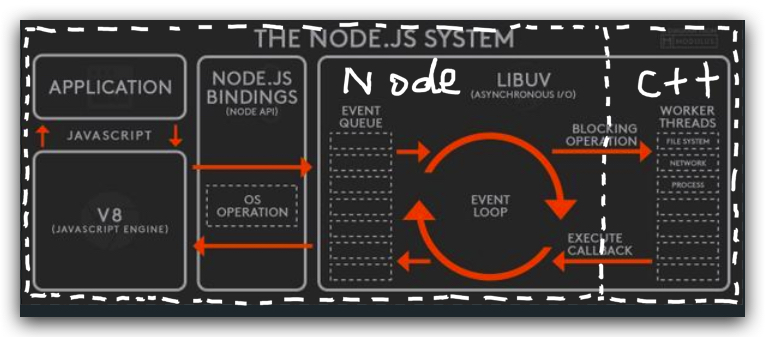

<!-- START doctoc generated TOC please keep comment here to allow auto update -->
<!-- DON'T EDIT THIS SECTION, INSTEAD RE-RUN doctoc TO UPDATE -->
## Table Of Content

- [异步](#%E5%BC%82%E6%AD%A5)
- [异步机制](#%E5%BC%82%E6%AD%A5%E6%9C%BA%E5%88%B6)
  - [非阻塞I/O](#%E9%9D%9E%E9%98%BB%E5%A1%9Eio)

<!-- END doctoc generated TOC please keep comment here to allow auto update -->

### 异步
- 绕不开的两点
  - 事件循环
  - 非阻塞I/O
- 结果
  - nodejs的高性能

### 异步机制
#### 非阻塞I/O
- 系统在接收`输入`到`输出`期间，还**可以**接收其他输入
  - **阻塞**: 餐厅阿姨从打菜到给菜，中间不能有其他人点菜 
  - **非阻塞**: 服务生从点菜到给菜，中间是可以给别人即系点菜的
- 理解要点
  - 先搞清楚输入和输出是谁
  - 再搞清楚输入和输出中间是否可以做别的

- 左侧只有一个nodejs线程, 所有I/O操作都是非阻塞的，会把任务分发给右侧很多的C++线程去完成
