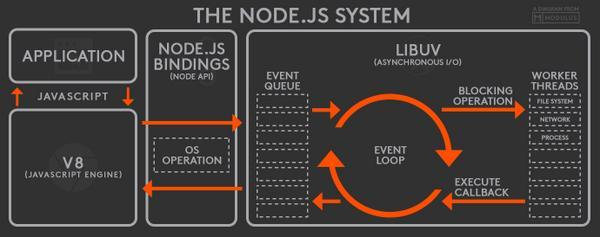

<!-- START doctoc generated TOC please keep comment here to allow auto update -->
<!-- DON'T EDIT THIS SECTION, INSTEAD RE-RUN doctoc TO UPDATE -->
## Table Of Content

- [内置模块](#%E5%86%85%E7%BD%AE%E6%A8%A1%E5%9D%97)
- [观察者模式](#%E8%A7%82%E5%AF%9F%E8%80%85%E6%A8%A1%E5%BC%8F)

<!-- END doctoc generated TOC please keep comment here to allow auto update -->

### 内置模块
- 让nodejs有能力和操作系统进行交互
- [10.17.0 Docs](https://nodejs.org/docs/latest-v10.x/api/)

<div style="text-align:center; margin:auto"></div>

### 观察者模式
- EventEmitter
  - `addListener()`
  - `removeEventListener()`
```javascript
const EventEmitter = require('events').EventEmitter;
class Geektime extends EventEmitter {
  constructor() {
    super();
    setInterval(() => {
      this.emit('newLession', { price: Math.random() * 100 })
    }, 3000)
  }
}

const geektime = new Geektime();
geektime.addListener('newLession', (event) => console.log(event))
// 可以无限添加listener
```
- 解决问题： `object之间通信`
  - 不知道被通知者的身份 -> 弊端：不该知道的知道了怎么办 ->直接调用
  - 没有通知者依然继续发通知 -> 弊端：白发怎么办 -> 直接调用